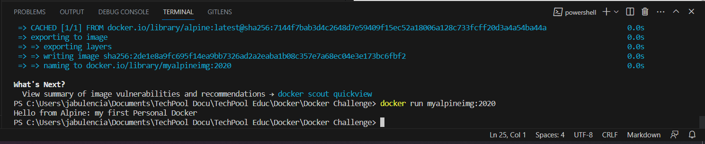

# My first Personal Docker Image
## Installation
#### Install Windows Docker
```link
    https://docs.docker.com/desktop/install/windows-install/
```
##### Alpine
```link
    https://hub.docker.com/_/alpine
```
`Dockerfile`
```docker
    FROM alpine:latest

    CMD echo "Hello from Alpine: my first Personal Docker"
```
##### Build
```bash
    docker build . -t myalpineimg:2020
```
##### Run
```bash
    docker run myalpineimg:2020
```

